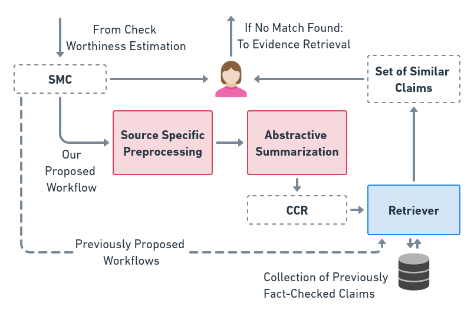

<p align="center">&nbsp;&nbsp;&nbsp;&nbsp;&nbsp;&nbsp;&nbsp;&nbsp;</p>

# Harnessing Abstractive Summarization for Fact-Checked Claim Detection

This is the Git repository for our paper titled, "Harnessing Abstractive Summarization for Fact-Checked Claim Detection". Accepted for publication at [COLING 2022](https://coling2022.org) as a long paper. It is available on [arXiv](https://arxiv.org/abs/2209.04612) and additionally also [here](http://dipteshkanojia.github.io/publication/coling-2022-factcheck/).

## Proposed Workflow

<p align="center"></p>

## Scripts

1. Datafile_Generator: Generating preprocessed files from raw data file.
2. Raw_T11_OOB_Models: Raw, Truncate 11 and OOB experiments.
3. T5_Training: T5 Fine Tuning
4. DistilBART_Training: DistilBART Fine Tuning
5. Pegasus_Training: DistilPEGASUS Fine Tuning
6. Evaluation: Retrieval Evaluation
7. Decoding Experiments: Various decoding strategies

Note: Some API calls require keys for authentication. They can be generated free of cost using a Google account. We have denoted these by '<your_key>' wherever applicable in the code.

## Data

The 576 pairs released as part of this work are present in `released_data.csv` . Please refer to the 'Dataset' section in the [paper](https://arxiv.org/abs/2209.04612) for further details.

### Data Labels

1. \#: Unique ID given to each pair.
2. tweet_id: Tweet ID assigned by Twitter. This can be used to retrieve the original tweet.
3. evidence_url: The URL of the corresponding factchecking article.
4. claim_reviewed: The gold summary of the claim as retreived from evidence URLs.
5. indian: 1 represents that the corresponding claim review has been taken from an Indian factchecking organization and 0 represents that the claim review has been taken from an American factchecking organization.

Note: Some of the tweets corresponding to the IDs may have been deleted due to [Twitter policies on manipulated-media](https://help.twitter.com/en/rules-and-policies/manipulated-media).

## Models

The fine-tuned models with running instructions are available on HuggingFace:

https://huggingface.co/varadhbhatnagar/fc-claim-det-DPEGASUS

https://huggingface.co/varadhbhatnagar/fc-claim-det-DBART

https://huggingface.co/varadhbhatnagar/fc-claim-det-T5-base

## Citation

Varad Bhatnagar, Diptesh Kanojia, Kameswari Chebrolu (2022). Harnessing Abstractive Summarization for Fact-Checked Claim Detection. Proceedings of The 29th International Conference on Computational Linguistics (COLING 2022).

### BiBTeX Citation

```latex
@misc{https://doi.org/10.48550/arxiv.2209.04612,
  doi = {10.48550/ARXIV.2209.04612},
  url = {https://arxiv.org/abs/2209.04612},
  author = {Bhatnagar, Varad and Kanojia, Diptesh and Chebrolu, Kameswari},
  keywords = {Computation and Language (cs.CL), FOS: Computer and information sciences, FOS: Computer and information sciences},
  title = {Harnessing Abstractive Summarization for Fact-Checked Claim Detection},
  publisher = {arXiv},
  year = {2022},
  copyright = {Creative Commons Attribution Non Commercial Share Alike 4.0 International}
}
```
